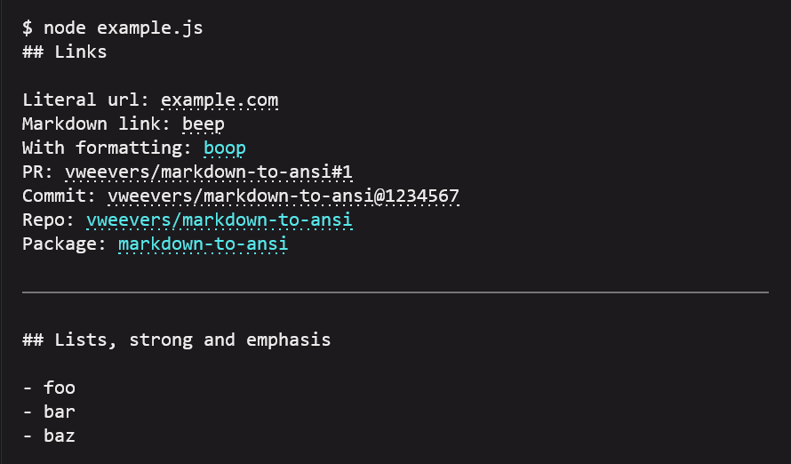
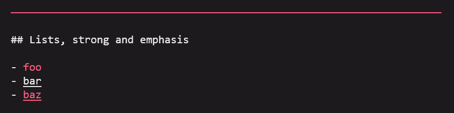

# markdown-to-ansi

**Convert markdown to ansi with support of hyperlinks.**

[](https://www.npmjs.org/package/markdown-to-ansi)
[](https://www.npmjs.org/package/markdown-to-ansi)

[](https://standardjs.com)

## Features

Meant for short snippets of markdown, `markdown-to-ansi` supports a subset of (GFM) markdown:

- Inline code
- Links. If [the terminal does not support hyperlinks]((https://gist.github.com/egmontkob/eb114294efbcd5adb1944c9f3cb5feda#supporting-apps)), only the url is returned.
- Literal urls. GitHub and npm urls are shortened (see example below).
- Emphasis and strong
- Headings (only one level)
- Thematic breaks (`---`)

Other markdown is simply returned as markdown (not necessarily as-is because it does go through a parser). Pull requests are welcome to support additional markdown syntax. It's easy to extend because `markdown-to-ansi` is built on the [`micromark`](https://github.com/micromark/micromark) parser and friends.

## Usage

`example.md`:

```
## Links

Literal url: https://example.com
Markdown link: [beep](https://example.com)
With formatting: [`boop`](https://example.com)
PR: https://github.com/vweevers/markdown-to-ansi/pull/1
Commit: https://github.com/vweevers/markdown-to-ansi/commit/1234567
Repo: https://github.com/vweevers/markdown-to-ansi
Package: https://www.npmjs.com/package/markdown-to-ansi

---

## Lists, strong and emphasis

- **foo**
- _bar_
- **_baz_**
```

`example.js`:

```js
const transform = require('markdown-to-ansi')()
const fs = require('fs')

const markdown = fs.readFileSync('example.md', 'utf8')
const result = transform(markdown)

console.log(result)
```

Results in:



My terminal doesn't support bold, so let me demonstrate custom styles:

```js
const chalk = require('chalk')
const transform = require('markdown-to-ansi')({
  style: {
    thematicBreak: chalk.red,
    emphasis: chalk.underline,
    strong: chalk.red
  }
})
```

Results in:



## API

### `transform = require('markdown-to-ansi')([options])`

Factory that returns a `transform` function. Options:

- `stream`: stream to detect support of hyperlinks on, defaults to `stdout`
- `width` (number): terminal width, used for thematic breaks, defaults to `stream.columns`
- `style` (object): override one or more styles by providing functions that return a formatted string for:
  - `inlineCode`
  - `heading`
  - `emphasis`
  - `strong`
  - `thematicBreak`.

### `ansi = transform(markdown)`

Takes a `markdown` string, returns a string containing ansi escape sequences.

## Install

With [npm](https://npmjs.org) do:

```
npm install markdown-to-ansi
```

## License

[MIT](LICENSE) © Vincent Weevers
